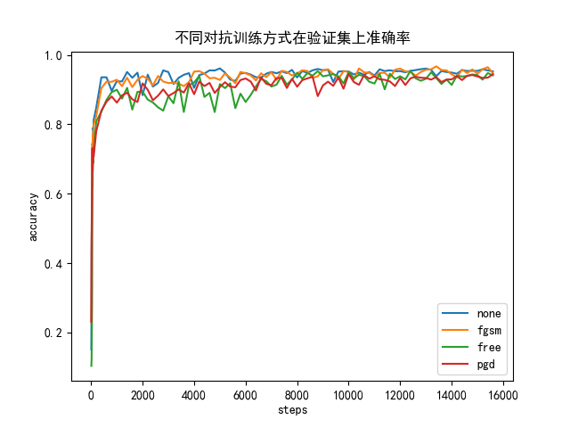

### 准备数据
使用的数据集为[THUCNews](http://thuctc.thunlp.org/)，为了加速实验，使用了别人提供的一个子集，
文本涉及10个类别：categories = ['体育', '财经', '房产', '家居', '教育', '科技', '时尚', '时政', '游戏', '娱乐']  

cnews.train.txt: 训练集(5000*10)  
cnews.val.txt: 验证集(500*10)  
cnews.test.txt: 测试集(1000*10)

#### 下载数据
将cnews.train.txt, cnews.val.txt, cnews.test.txt放到data目录下  
下载链接: [https://pan.baidu.com/s/1DOgxlY42roBpOKAMKPPKWA](https://pan.baidu.com/s/1DOgxlY42roBpOKAMKPPKWA)，密码: up9d

#### 构建词表
会在data目录下生成vocab.txt文件
```python
python dataset.py --dataset_dir data
```


### 训练
训练结束后模型会保存在models目录下

```python
python main.py --attack_mode none --dataset_dir data
python main.py --attack_mode pgd --dataset_dir data
python main.py --attack_mode free --dataset_dir data
python main.py --attack_mode fgsm --dataset_dir data
```

### 测试

```python
python main.py --test --attack_mode none --dataset_dir data
python main.py --test --attack_mode pgd --dataset_dir data
python main.py --test --attack_mode free --dataset_dir data
python main.py --test --attack_mode fgsm --dataset_dir data
```

### 结果
绘制不同算法的训练过程，在验证集上的准确率


```python
python plot.py
```

#### 测试集指标
|  | precision | recall | f1 |
| :-----| :----: | :----: | :----: |
| baseline | 0.9531 | 0.9520 | 0.9517 |
| PGD | 0.9554 | 0.9551 | 0.9548 |
| Free | 0.9504 | 0.9501 | 0.9496 |
| FGSM | 0.9567 | 0.9563 | 0.9560 |

#### 训练时长
在单卡GPU-1070上训练20个epoch

|  | 时长（分） |
| :-----| :----: |
| baseline | 5.53 |
| PGD | 30.40 |
| Free | 5.53 |
| FGSM | 10.57 |

### 参考
[https://github.com/cjymz886/fast_adversarial_for_text_classification](https://github.com/cjymz886/fast_adversarial_for_text_classification)
[https://github.com/locuslab/fast_adversarial](https://github.com/locuslab/fast_adversarial)